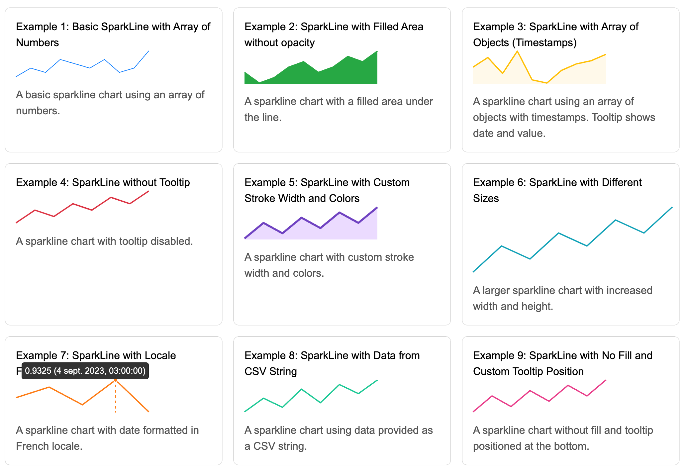

📈 Simple SparkLine Chart

A lightweight, customizable, and easy-to-use SparkLine chart library written in TypeScript.

[DEMO](https://codepen.io/dejurin/pen/QWeELog) 👀



🚀 Features

- 🔥 Lightweight - Small footprint and blazing fast rendering.
- 🎨 Customizable - Control colors, sizes, tooltips, and more.
- 🎯 TypeScript Support - Fully typed for better development experience.
- 📦 Multiple Formats - Available as CommonJS, ESModule, and a global script for easy CDN usage.

## 📦 Installation

### Using npm:

    npm install simple-sparkline-chart

### Using CDN:

```html
<script src="https://www.unpkg.com/simple-sparkline-chart"></script>
```

You can then use it via the global SimpleSparkLineChart:

```html
<script>
  new SimpleSparkLineChart(".chart");
</script>
```

## 📚 Usage

### 1️⃣ Basic Example

```html
<div
  class="sparkline"
  data-values="1,2,3,4,5,6,7"
  data-width="200"
  data-height="40"
></div>

<script>
  new SimpleSparkLineChart(".sparkline");
</script>
```

This will create a basic SparkLine chart using the specified data-values.

### 2️⃣ With Custom Options

```html
<div
  class="sparkline"
  data-values="0.5,1.5,2.3,3.8,2.9,3.4"
  data-width="300"
  data-height="60"
  data-color-stroke="#00f"
  data-filled="true"
  data-filled-opacity="0.3"
  data-tooltip="true"
  data-aria-label="My SparkLine Chart"
></div>

<script>
  new SimpleSparkLineChart(".sparkline");
</script>
```

## 🔧 Data Attributes

| Attribute             | Type     | Default                   | Description                                                                                 |
|-----------------------|----------|---------------------------|---------------------------------------------------------------------------------------------|
| `data-values`         | string   | `null` **(Required)**      | A comma-separated list of values or JSON data to plot.                                       |
| `data-width`          | number   | `200`                     | The width of the chart in pixels.                                                            |
| `data-height`         | number   | Proportional to width      | The height of the chart in pixels. Automatically calculated based on width, maintaining a proportional aspect ratio. |
| `data-color-stroke`   | string   | `#8956ff`                 | The color of the chart line (stroke).                                                        |
| `data-filled`         | number   | (none)                    | Defines the opacity of the fill area under the line if set. If not provided, no fill is displayed. |
| `data-tooltip`        | string   | `top`                     | Tooltip position: "top" or "bottom". Tooltip is enabled if this attribute is set.            |
| `data-aria-label`     | string   | `Simple SparkLine Chart`   | Accessible label for the chart.                                                              |
| `data-locale`         | string   | User's locale              | The locale used for formatting dates in tooltips (if using timestamp data).                  |

## 🧑‍💻 API

You can initialize the chart with the SimpleSparkLineChart constructor, and it automatically processes all matching elements.

### Constructor

new SimpleSparkLineChart(selector: string);

- selector: A CSS selector string to target the elements where the chart will be rendered.

### 🎨 Customization

You can customize the following:

1. Stroke and Fill: Set your own colors for the line and the area below it with data-color-stroke and data-filled.
2. Dimensions: Control the width and height of the chart using data-width and data-height.
3. Tooltips: Enable or disable tooltips with data-tooltip, and adjust their position with data-tooltip-position.

## 📊 Example of Object Data

You can pass an array of objects with timestamps and values:

```html
<div
  class="sparkline"
  data-values='[
        {"timestamp":1693526400000,"value":0.93},
        {"timestamp":1693612800000,"value":0.9315}
    ]'
  data-tooltip="true"
></div>

<script>
  new SimpleSparkLineChart(".sparkline");
</script>
```

🚀 Optimized for Performance

- Minimized for production: The library is optimized to deliver minimal JS overhead.
- Supports all modern browsers: Works in all major browsers including Chrome, Firefox, Safari, and Edge.

## 🔥 CDN Usage

For quick usage without installing npm dependencies:

```html
<script src="https://www.unpkg.com/simple-sparkline-chart"></script>
```

## 🔧 Development

To build the project locally:

# Install dependencies

    npm install

# Run the development server

    npm start

# Build the project

    npm run build

# Run tests

    npm run test

## 📝 License

This project is licensed under the MIT License - see the LICENSE file for details.

💬 Feedback and Contributions

Feel free to open an issue if you find a bug or have a feature request. Pull requests are welcome! 🙌

Hope you enjoy using Simple SparkLine Chart! 🚀✨
